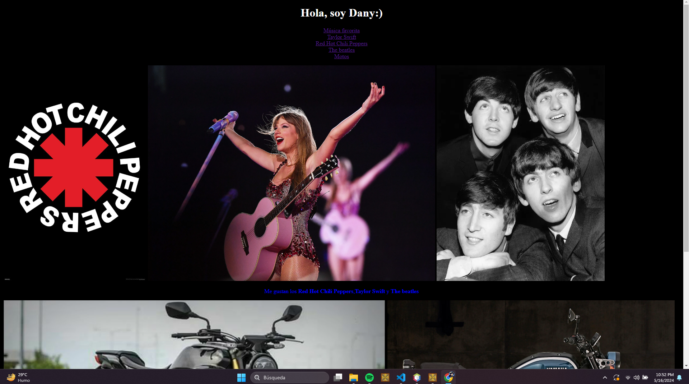
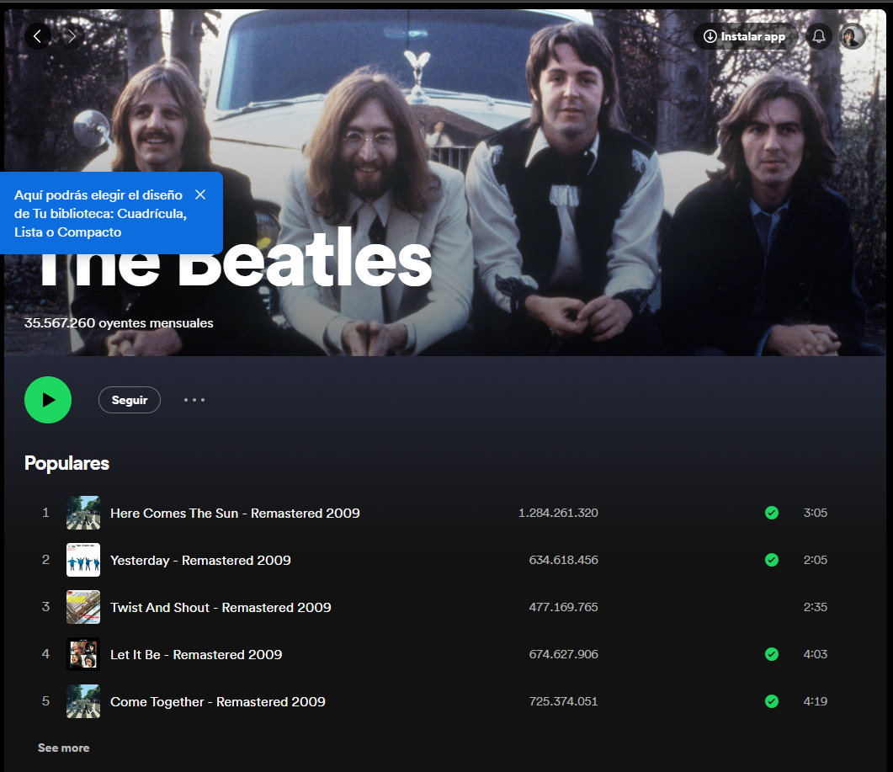
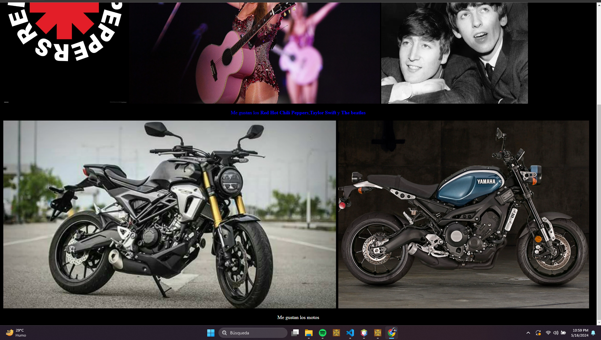

Esta página web fue elaborada con los principios básicos de html, un poco de CSS para el bootcamp de TECNOLOCHICAS

Así es como se ve la página a primera vista.

Si damos clic a cualquiera de los nombres de las bandas o artistas, se nos abre su perfil de spotify en otra pestaña. Por ejemplo:

Si damos clic en donde dice "Motos", se nos desplaza hacia abajo en donde se encunetran las imágenes de las motos

Créditos: Daniela Rodríguez Catalán